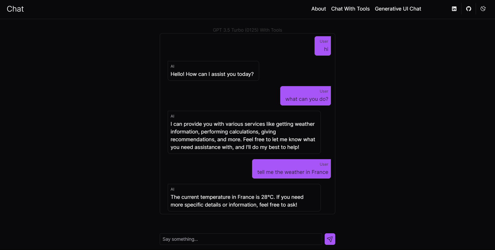
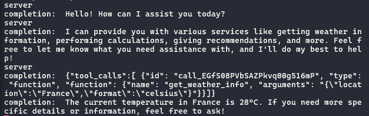
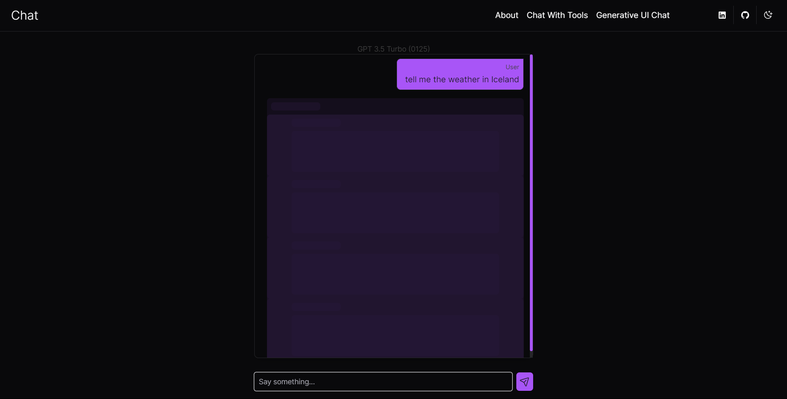
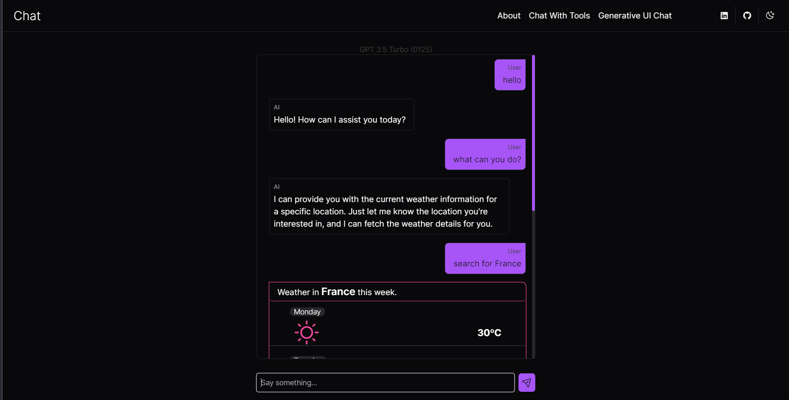
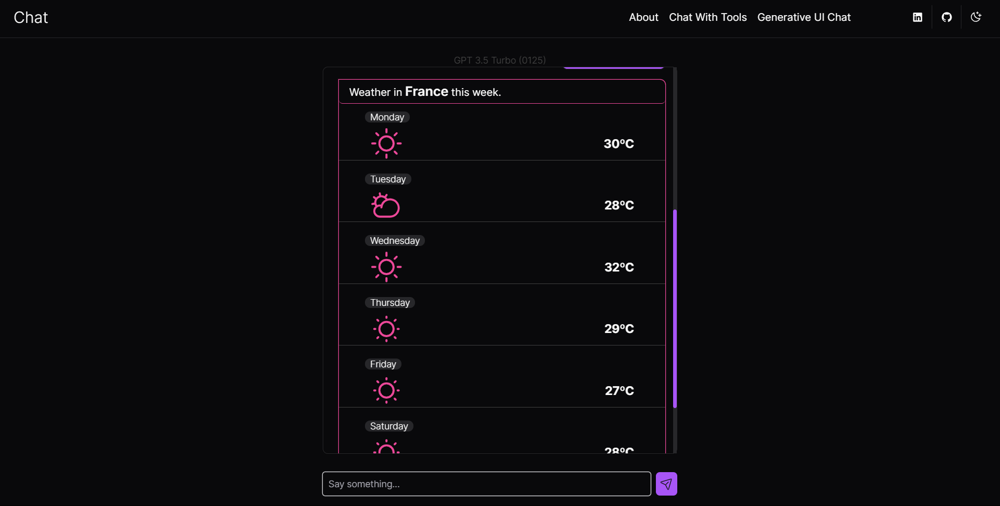

This project was done using only `Next.js` (back-end and front-end), try it out [here](https://carlos-neto-nextjs-ai-chat.vercel.app/) - In this <i>"version"</i> <small>`(v0.1-lw)`</small> I'm using `OpenAI`. Due to the fact of being poor 😒, 
the Tool Calling and Generative UI is not yet available in the production environment.

Currently to work with Generative UI, Vercel's AI SDK only supports OpenAI with their `render` function
which you can check out in their documentation about [Generative UI](https://sdk.vercel.ai/docs/concepts/ai-rsc). You can also check out their blog post announcing their AI SDK 3.0 and their SaaS v0 [here](https://vercel.com/blog/ai-sdk-3-generative-ui).
# back-end

Everything was done following the [Vercel  AI SDK documentation](https://sdk.vercel.ai/docs).
I'm also using TypeScript for a stronger typing. The model used in the main chat, is the one that Vercel uses in its documentation about Hugging Face, the `OpenAssistant` model,
which is free and open-source. 

I'm accessing this model through `Hugging Face` which now is basically a GitHub for AI models. 
You just need to create an API key in your Hugging Face account and add to your environment variables like this:

```env
HUGGINGFACE_API_TOKEN="hf_secret-key"
```
## Tool Calling (Only works with OpenAI)
There are some models that support `tool calling` but the AI SDK makes the configuration easier for OpenAI. It can also work with other providers and models, but it takes a little more configurations that I not yet know how to set up.

Here is what we want: <i>An AI that is able to access external information such as <b>the weather</b>.</i>

Here is the chat interaction:



Here is the AI responses `(completion: \AI Response\)`:



In order to do this you have to specify your tools using the Tool interface from your provider, for OpenAI it goes like this:

`app/api/chat-with-tools.ts` (see the full code inside the file in this file path)
```ts
import { Tool } from "ai";

const tools: Tool[] = [
  {
    type: "function",
    function: {
      name: "get_weather_info",
      description:
        "Get the weather information for a specific location when the user asks for it.",
      parameters: {
        type: "object",
        properties: {
          location: {
            type: "string",
            description: "The location to get the weather from.",
          },
          format: {
            type: "string",
            enum: ["celsius", "fahrenheit"],
            description:
              "The temperature unit to use. Infer this from the users location.",
          },
        },
        required: ["location", "format"],
      },
    },
  },
];
```
When creating the chat in the `POST` method in your endpoint, pass the defined tools to it, and set the `tool_choice` to `auto` so the AI decides what tool to use based on the user's input:

```ts
 const { messages } = await req.json();

  const response = await openai.chat.completions.create({
    model: "gpt-3.5-turbo-0125",
    stream: true,
    messages: [
      {
        role: "system",
        content:
          "You are a helpful assistant that can access external functions. The responses from these function calls will be appended to this dialogue. Please provide responses based on the information from these function calls.",
      },
      ...messages,
    ],
    tools,
    tool_choice: "auto",
  });
```
After providing the user's input and the tools we just need to get the AI's response and stream the data.

```ts
 const data = new experimental_StreamData();

  const stream = OpenAIStream(response, {
    experimental_streamData: true,
    experimental_onToolCall: async (
      call: ToolCallPayload,
      appendToolCallMessage
    ) => {
      for (const toolCall of call.tools) {
        if (toolCall.func.name === "get_weather_info") {
          //call any API here!!
          const weatherData = {
            temperature: "28º",
            location: toolCall.func.arguments.location
              ? (toolCall.func.arguments.location as string)
              : "",
            unit: toolCall.func.arguments.format === "celsius" ? "C" : "F",
          };

          const newMessages = appendToolCallMessage({
            tool_call_id: toolCall.id,
            function_name: "get_weather_info",
            tool_call_result: weatherData,
          });

          return openai.chat.completions.create({
            model: "gpt-3.5-turbo-0125",
            stream: true,
            messages: [...messages, ...newMessages],
            tools,
            tool_choice: "auto",
          });
        }
      }
    },
    onCompletion(completion) {
      console.log("completion: ", completion);
    },
    onFinal(completion) {
      data.close();
    },
  });


  return new StreamingTextResponse(stream, {}, data);
```
The data stream only works if the `experimental_streamData` property is set to true in the `OpenAIStream`, if it is not, the only output will be in the console.
The client is the same as it would be without the tools using the `useChat` hook.

The weather data is hard coded to make the example simple, but it is simple to make an external API call inside the executed function.

## Generative UI
The Generative UI follows the same idea as the Tool Calling, an AI that is able to access external APIs, in this case, it is able to tell weather information, the only difference is that it streams components to render with the information, which opens more possibilities to external API calls by clicking in buttons in the generated components.

Here is what we want:
- A skeleton when the tool is being executed, to show the user some response and prepare the UI to the actual component:



- Rendering a component with a external API data.




To set up your AI to generate components, create an server action like:

`app/action.tsx`
```ts

async function submitUserMessage(input: string) {
'use server';
/* rest of your code */
}

```
This action is divided in three parts:

- Setting the [AIState](https://sdk.vercel.ai/docs/concepts/ai-rsc#aistate) <small>(you can learn more about it in the AI SDK documentation)</small> with the user's input:

```ts
const aiState = getMutableAIState<typeof AI>();

  aiState.update([
    ...aiState.get(),
    {
      role: "user",
      content: input,
    },
  ]);
```
NOTE: the `typeof AI` will not work until you create the `AI` with the `createAI` function from AI SDK.

- Creating the `ui` with the AI SDK `render` function, which currenctly only supports OpenAI as its provider:

```ts
 const ui = render({
    provider: openai,
    model: "gpt-3.5-turbo-0125",
    messages: [
      {
        role: "system",
        content: `You are a helpful assistant that can access external functions when the user asks for.
          If the user asks for the weather and passes the location, call \`getWeatherInfo\` to show current weather at that location.`,
      },
      {
        role: "user",
        content: input,
      },
    ],
    text: ({ content, done }) => {
      if (done) {
        aiState.done([
          ...aiState.get(),
          {
            role: "assistant",
            content,
          },
        ]);
      }

      return (
        <div className="flex w-full">
          <Message from="ai">{content}</Message>
        </div>
      );
    },
    initial: (
      <div>
        <PiSpinnerGap className="animate-spin text-muted" size={25} />
      </div>
    ),
    functions: {
      getWeatherInfo: {
        description:
          "Get the information for the weather according to a certain location.",
        parameters: z.object({
          location: z
            .string()
            .describe("The location to get the weather from."),
        }),
        render: async function* ({ location }) {
          //component returned until the API call process is not done
          yield <WeekWeatherSkeleton />;

          //can call from other func to get information from an external API
          const weatherInfo = await getWeather();

          await sleep(2000);

          aiState.done([
            ...aiState.get(),
            {
              id: randomUUID(),
              role: "function",
              name: "getWeatherInfo",
              content: JSON.stringify(weatherInfo),
            },
          ]);

          //component returned after the API call
          return (
            <WeeakWeather location={location} weather={weatherInfo.weather} />
          );
        },
      },
    },
  });
```
- `render`
    - This is a big function so lets break it down. The top three properties is nothing new, you have a `provider` which is the AI's API that you are going to call, the `model` that you want from this provider to process your parameters and the `messages` with a system message telling the AI what to do when it comes to the tool calling.
    - the `text` function is used to stream the current LLM's response, and the response is added to the AIState when it is done.
    - `initial` is just a `ReacNode` to show the user something while the LLM is getting and processing the data.
    - `functions` here is where we are going to define our tools, first you pass the name of the tool, which is an object with `description`, which makes easier to the AI select the most accurate tool, `parameters`, which defines the params that the function needs and must be provided from the user if it is required and the `render` generator function, which is actually rendering the components used to display the external API's response. We have the `WeekWeatherSkeleton`, displayed while the <i>"external API"</i> is being called and the return with the API's data inside the component. 

 - To end this part, just return the chat UI:
 ```ts 
  return {
    id: Date.now(),
    display: ui,
  };
 ```

 In order to this work on the client side, we need to create the AI provider with the server actions and initial UI and AI state.

 ```ts
 export const AI = createAI({
  actions: {
    submitUserMessage,
  },
  initialAIState,
  initialUIState,
});
 ```

The client side is a bit different when using Generative UI, check out the `front-end/Generative UI` section.

# front-end

I'm using `TailwindCSS` which comes by default with Next.js, `shadcn/ui`, to have base components ready and styled quickly and `next-themes` to provide themes to my application.

## Generative UI

The client needs to consume the AI provider, like this:
```ts
import { AI } from "../action";
import { GenerativeUIChat } from "./fragments/generative-ui-chat";

export default function GenerativeUIPage() {
  return (
    <AI>
      <GenerativeUIChat />
    </AI>
  );
}

```
Here is the `GenerativeUIChat` component:

```ts
"use client";

import { Button } from "@/components/ui/button";
import { Input } from "@/components/ui/input";
import { cn } from "@/lib/utils";
import { PiPaperPlaneTilt, PiRobotThin } from "react-icons/pi";
import { useUIState, useActions } from "ai/rsc";
import { useState } from "react";
import { AI } from "@/app/action";
import { Message } from "@/components/message";

export function GenerativeUIChat() {
  const [messages, setMessages] = useUIState<typeof AI>();
  const { submitUserMessage } = useActions<typeof AI>();
  const [input, setInput] = useState<string>('');

  async function handleSubmit(e: React.FormEvent<HTMLFormElement>) {
    e.preventDefault();

    // Add user message to UI state
    setMessages((curr) => [
      ...curr,
      {
        id: Date.now(),
        display: (
          <div className="flex w-full justify-end">
            <Message from="user">{input}</Message>
          </div>
        ),
      },
    ]);

    // Submit and get response message
    const responseMessage = await submitUserMessage(input);
    setMessages((currentMessages) => [...currentMessages, responseMessage]);

    setInput('');
  }

  return (
    <div className="flex flex-col w-full max-w-xl px-4 h-[calc(100vh-4rem)] justify-between items-center mx-auto">
      <div className="flex flex-col w-full max-w-xl max-h-[calc(100%-4.5rem)] pt-6">
        <span className="w-full text-center text-sm text-muted">
          GPT 3.5 Turbo (0125)
        </span>
        {messages.length === 0 ? (
          <div className="flex flex-col gap-8 w-full items-center">
            <span className="text-2xl font-semibold text-center">
              Start a conversation with the AI.
            </span>
            <PiRobotThin size={100} />
          </div>
        ) : (
          <div
            className={cn(
              "[&::-webkit-scrollbar]:w-[0.35rem] [&::-webkit-scrollbar-track]:bg-accent [&::-webkit-scrollbar-thumb]:bg-primary [&::-webkit-scrollbar-thumb]:rounded-lg [&::-webkit-scrollbar-thumb:hover]:bg-primary/50",
              "p-2 px-6 pr-3 flex flex-col gap-4 border border-input rounded-lg mb-2 overflow-auto shadow-sm shadow-black/30 transition duration-300 hover:shadow-lg"
            )}
          >
            {
              // View messages in UI state
              messages.map((message) => message.display)
            }
          </div>
        )}
      </div>
      <form className="w-full" onSubmit={handleSubmit}>
        <div className="flex gap-2 w-full py-4">
          <Input
            className="p-2 border border-input rounded shadow-sm bg-background"
            value={input}
            placeholder="Say something..."
            onChange={(event) => {
              setInput(event.target.value);
            }}
          />
          <Button size="icon">
            <PiPaperPlaneTilt size={20} />
          </Button>
        </div>
      </form>
    </div>
  );
}

```
The important part here is how we render the messages which is with the `display` property returned from the server action and adding the user's input to the UI in the `handleSubmit` method.

# Extra
Have fun chating with the **AI**, just be careful with what you wish for ☠️☠️


